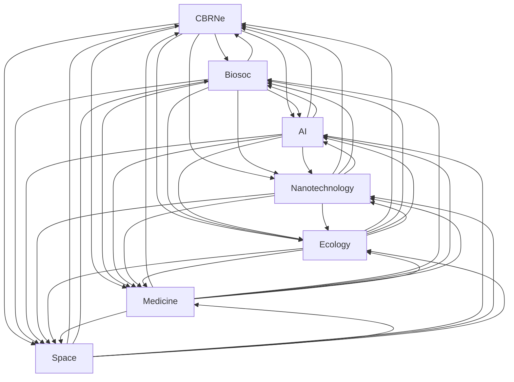

# [biokomputery.pl](http://www.biokomputery.pl)

## Wstęp

Poniżej omówiono koncepcje biokomputerów, biocomputingu i biosoc (społeczeństwa biologicznego), koncentrując się na ich potencjale, korzyściach, wyzwaniach i możliwych rozwiązaniach.

### Biocomputing i biokomputery:
- Zwiększona moc obliczeniowa i efektywność energetyczna otwierają nowe możliwości w medycynie i badaniach naukowych.
- Zastosowania obejmują medycynę spersonalizowaną, analizę danych biologicznych i projektowanie leków.
- Wyzwania dotyczą bezpieczeństwa biologicznego, etyki, prywatności i potencjalnych zagrożeń ekologicznych.

### Rozwój biokomputerów wymaga:
- Regulacji prawnych i etycznych
- Standardów bezpieczeństwa
- Edukacji społeczeństwa
- Międzynarodowej współpracy

### Biosoc (społeczeństwo biologiczne):
- Integracja biologii z technologią i życiem społecznym
- Wyzwania obejmują prywatność, bezpieczeństwo, etykę, nierówności, zdrowie, wpływ na środowisko, edukację, kontrolę i adaptację społeczną.

### Proponowane rozwiązania dla wyzwań biosoc:
- Zaawansowane systemy szyfrowania danych
- Międzynarodowe komitety etyczne
- Programy zapewniające dostęp do technologii
- Długoterminowe badania nad wpływem na zdrowie
- Edukacja i programy adaptacyjne

## Biocomputing

Biocomputing to bardzo perspektywiczna technologia, która może przynieść ogromne korzyści, ale jednocześnie wymaga ostrożnego podejścia.

### Potencjalne korzyści:
- Zwiększona moc obliczeniowa i efektywność energetyczna
- Nowe możliwości w diagnostyce medycznej i leczeniu chorób
- Postęp w badaniach naukowych, szczególnie w biologii molekularnej
- Rozwój zrównoważonych technologii obliczeniowych

### Obszary zastosowań:
- Medycyna spersonalizowana
- Analiza dużych zbiorów danych biologicznych
- Projektowanie leków
- Symulacje procesów biologicznych

### Wyzwania i zagrożenia:
- Bezpieczeństwo biologiczne i potencjalne ryzyko dla zdrowia
- Kwestie etyczne związane z wykorzystaniem materiałów biologicznych
- Ochrona prywatności danych genetycznych
- Potencjalne niezamierzone konsekwencje dla ekosystemów

### Aspekty wymagające szczególnej uwagi:
- Regulacje prawne i etyczne
- Standardy bezpieczeństwa i kontroli jakości
- Edukacja społeczeństwa na temat biokomputerów
- Międzynarodowa współpraca w zakresie badań i rozwoju

### Podejście do rozwoju:
- Stopniowe i kontrolowane wdrażanie technologii
- Ciągłe monitorowanie i ocena ryzyka
- Interdyscyplinarne podejście łączące biologię, informatykę i etykę
- Transparentność w badaniach i komunikacji z opinią publiczną

## Biokomputery

Biokomputery, które wykorzystują biologiczne materiały i mechanizmy do przetwarzania informacji, oferują szereg korzyści, ale także niosą ze sobą pewne zagrożenia.

### Korzyści biokomputerów:

1. **Efektywność energetyczna**: Biokomputery mogą być znacznie bardziej efektywne energetycznie niż tradycyjne komputery oparte na krzemie.
2. **Miniaturyzacja**: Dzięki możliwości przetwarzania informacji na poziomie molekularnym, biokomputery mogą potencjalnie osiągnąć znacznie mniejsze rozmiary.
3. **Biokompatybilność**: Ze względu na ich biologiczne komponenty, biokomputery mogą być bardziej zgodne z organizmami żywymi, co ułatwia integrację w zastosowaniach medycznych.
4. **Przetwarzanie równoległe**: Podobnie jak ludzki mózg, niektóre biokomputery mogą wykonywać ogromne ilości operacji jednocześnie, co zwiększa ich potencjalną wydajność.
5. **Odpady i ekologiczność**: Zastąpienie elementów elektronicznych biologicznymi może prowadzić do redukcji odpadów elektronicznych i zmniejszenia negatywnego wpływu na środowisko.

### Zagrożenia biokomputerów:

1. **Bezpieczeństwo biologiczne**: Manipulowanie organizmami żywymi niesie ze sobą ryzyka związane z biobezpieczeństwem, jak np. niezamierzone powstawanie szkodliwych patogenów.
2. **Nieprzewidywalność**: Systemy biologiczne mogą być bardziej niestabilne i trudniejsze do kontrolowania niż tradycyjne systemy komputerowe.
3. **Etyka**: Wprowadzenie biokomputerów może budzić pytania etyczne, szczególnie w kontekście manipulacji genetycznych i modyfikacji organizmów żywych.
4. **Kompleksowość**: Tworzenie i utrzymanie biokomputerów może wymagać zaawansowanych technologii i wiedzy z zakresu biologii i inżynierii biomedycznej, co może zwiększyć koszt i skomplikować proces rozwoju.
5. **Ryzyka zdrowotne**: Długotrwała ekspozycja na biokomputery lub wszczepienia mogłyby potencjalnie prowadzić do nieprzewidzianych konsekwencji zdrowotnych.

## Przykład użycia komputera w implementacji **wetware** - integracji człowieka z maszyną:

**Implanty mózgowe**: Jednym z najprostszych przykładów jest rozwój neuroprotez i implantów mózgowych, takich jak system Brain-Computer Interface (BCI). 

**Przykład:** **Neuralink** - firma założona przez Elona Muska, pracuje nad stworzeniem interfejsu mózg-komputer. Celem jest umożliwienie bezpośredniej komunikacji między mózgiem a komputerami, co może mieć zastosowanie w medycynie (np. pomóc w leczeniu paraliżu) lub jako sposób na rozszerzenie możliwości ludzkiego mózgu. Systemy implantów mogą potencjalnie umożliwić ludziom sterowanie komputerami lub protezami za pomocą myśli, przywracając funkcje utracone w wyniku urazów lub chorób neurologicznych.

## Research & Development

Oczywiście, rozwój biokomputerów wiąże się z wieloma wyzwaniami. 
Oto szczegółowe omówienie najważniejszych z nich:

### Bezpieczeństwo biologiczne:
- Ryzyko niekontrolowanego rozprzestrzeniania się zmodyfikowanych organizmów
- Potencjalne zagrożenia dla zdrowia ludzi pracujących z biokomputerami
- Konieczność opracowania skutecznych metod izolacji i kontroli systemów biokomputerowych

### Stabilność i niezawodność:
- Zapewnienie stabilnego działania w różnych warunkach środowiskowych
- Kontrola mutacji i zmian genetycznych w organizmach używanych w biokomputerach
- Opracowanie metod długoterminowego przechowywania i konserwacji biokomputerów

### Skalowalność:
- Trudności w zwiększaniu mocy obliczeniowej biokomputerów do poziomu porównywalnego z tradycyjnymi komputerami
- Wyzwania związane z integracją biokomputerów z istniejącą infrastrukturą IT

### Etyka i regulacje prawne:
- Konieczność ustalenia jasnych ram etycznych dla badań i zastosowań biokomputerów
- Opracowanie odpowiednich regulacji prawnych uwzględniających specyfikę tej technologii
- Rozwiązanie dylematów etycznych związanych z wykorzystaniem materiałów biologicznych

### Ochrona danych i prywatności:
- Zabezpieczenie wrażliwych danych biologicznych przetwarzanych przez biokomputery
- Opracowanie metod szyfrowania i ochrony informacji genetycznych

### Interfejs człowiek-biokomputer:
- Stworzenie efektywnych metod komunikacji między ludźmi a biokomputerami
- Zapewnienie intuicyjnego i bezpiecznego interfejsu użytkownika

### Standaryzacja:
- Wypracowanie wspólnych standardów dla badań i rozwoju biokomputerów
- Ustalenie protokołów testowania i walidacji systemów biokomputerowych

### Edukacja i akceptacja społeczna:
- Konieczność edukacji społeczeństwa na temat biokomputerów i ich potencjalnego wpływu
- Przezwyciężenie obaw i sceptycyzmu związanego z wykorzystaniem organizmów żywych w technologii

### Finansowanie i komercjalizacja:
- Wysokie koszty badań i rozwoju biokomputerów
- Trudności w przekonaniu inwestorów do długoterminowych i ryzykownych projektów

### Interdyscyplinarność:
- Potrzeba ścisłej współpracy między biologami, informatykami, inżynierami i etykami
- Wyzwania związane z komunikacją i integracją wiedzy z różnych dziedzin

## Biosoc

Biosoc to skrót od "biological society", czyli "społeczeństwo biologiczne".
Jest to koncepcja, która łączy biologię z życiem społecznym i technologią. 
Wyobraź sobie świat, w którym nasze ciała i biologia stają się częścią technologii, którą używamy na co dzień.
Biosoc to fascynująca koncepcja, która może przynieść wiele korzyści, ale też stawia przed nami poważne wyzwania.
Ważne jest, abyśmy o tym dyskutowali i zastanawiali się, jak chcemy, aby wyglądała nasza przyszłość.

### Przykład:

Zamiast nosić smartwatch na nadgarstku, mógłbyś mieć maleńki chip wszczepiony pod skórę, który monitoruje twoje zdrowie i łączy się z twoim telefonem. Albo wyobraź sobie rośliny w twoim domu, które zmieniają kolor, gdy powietrze jest zanieczyszczone, działając jak żywe czujniki.

W biosoc, granica między tym, co biologiczne, a tym, co technologiczne, staje się coraz bardziej rozmyta. Nasze ciała, rośliny, a nawet bakterie mogą stać się częścią sieci technologicznej.

### Wyzwania związane z biosoc:

1. Prywatność: Jeśli nasze ciała są podłączone do sieci, jak chronić nasze dane zdrowotne i osobiste?

2. Bezpieczeństwo: Co się stanie, jeśli ktoś zhakuje biologiczne implanty lub modyfikacje?

3. Etyka: Czy modyfikowanie naszych ciał lub innych organizmów jest etyczne? Gdzie powinniśmy postawić granicę?

4. Nierówności: Czy wszyscy będą mieli równy dostęp do tych technologii, czy tylko bogaci?

5. Zdrowie: Jakie są długoterminowe skutki łączenia biologii z technologią dla naszego zdrowia?

6. Środowisko: Jak biosoc wpłynie na naturalne ekosystemy i środowisko?

7. Edukacja: Jak przygotować ludzi do życia w takim świecie? Jakich nowych umiejętności będziemy potrzebować?

8. Kontrola: Kto będzie kontrolował te technologie i jak zapewnić, że nie zostaną użyte do złych celów?

9. Adaptacja: Jak społeczeństwo dostosuje się do tak radykalnych zmian w naszym życiu i ciałach?

### Rozwiązania

Kluczowe jest, aby rozwój biosoc odbywał się w sposób odpowiedzialny, z uwzględnieniem potrzeb i obaw wszystkich członków społeczeństwa, poniżej przykłady potencjalnych rozwiązań dla każdego z wymienionych wyzwań.
Te rozwiązania są jedynie propozycjami i wymagałyby szczegółowego opracowania i testowania przed wdrożeniem. 

1. Prywatność:
- Zaawansowane systemy szyfrowania danych biologicznych
- Decentralizacja przechowywania danych (np. blockchain)
- Prawo do "biologicznego zapomnienia" - możliwość usunięcia swoich danych z systemów

2. Bezpieczeństwo:
- Wielopoziomowe systemy zabezpieczeń dla implantów i modyfikacji
- Regularne aktualizacje zabezpieczeń "bio-firmware"
- Fizyczne przełączniki do wyłączania funkcji łączności w sytuacjach awaryjnych

3. Etyka:
- Powołanie międzynarodowych komitetów etycznych ds. biosoc
- Opracowanie globalnego kodeksu etycznego dla modyfikacji biologicznych
- Edukacja etyczna w szkołach obejmująca kwestie biosoc

4. Nierówności:
- Programy rządowe zapewniające dostęp do podstawowych technologii biosoc dla wszystkich
- Systemy mikropożyczek na technologie biosoc
- Zachęty dla firm do tworzenia niedrogich wersji technologii biosoc

5. Zdrowie:
- Długoterminowe badania nad wpływem technologii biosoc na zdrowie
- Regularne monitorowanie zdrowia użytkowników technologii biosoc
- Rozwój technologii "bio-kompatybilnych" minimalizujących negatywny wpływ na organizm

6. Środowisko:
- Projektowanie technologii biosoc z myślą o minimalnym wpływie na ekosystemy
- Wykorzystanie biosoc do monitorowania i ochrony środowiska
- Tworzenie "bio-degradowalnych" wersji technologii

7. Edukacja:
- Wprowadzenie przedmiotu "bio-technologia" do programów szkolnych
- Platformy e-learningowe do nauki o biosoc
- Programy przekwalifikowania zawodowego dla dorosłych

8. Kontrola:
- Międzynarodowe traktaty regulujące rozwój i użycie technologii biosoc
- Niezależne agencje nadzorujące rozwój i wdrażanie biosoc
- Systemy "otwartego kodu" dla kluczowych technologii biosoc

9. Adaptacja:
- Stopniowe wprowadzanie technologii biosoc, dając społeczeństwu czas na adaptację
- Tworzenie "stref przejściowych" gdzie tradycyjne i biosoc technologie współistnieją
- Programy wsparcia psychologicznego dla osób mających trudności z adaptacją

## Struktura skojarzeń

Taka struktura zapewnia wszechstronne spojrzenie na temat biocomputingu i jego zastosowania w różnych dziedzinach, wzbogacone odpowiednimi hasztagami dla szybszego kontekstowego zrozumienia.

### Biocomputing

- **#DNAComputing**: Zastosowanie cząsteczek DNA do przeprowadzania obliczeń.
- **#MolecularComputing**: Wykorzystanie cząsteczek biologicznych do obliczeń.
- **#SyntheticBiology**: Modyfikacja systemów biologicznych do realizacji zadań informatycznych.
- **#BioinformaticsAI**: Integracja bioinformatyki z metodami sztucznej inteligencji.
- **#BioInspiredComputing**: Tworzenie systemów obliczeniowych wzorowanych na mechanizmach biologicznych.
  
### CBRNe

- **#CBRNDefense**: Obrona przed zagrożeniami chemicznymi, biologicznymi, radiacyjnymi i nuklearnymi.
- **#BiologicalThreats**: Zagrożenia biologiczne i ich kontrola.
- **#ChemicalWarfare**: Wojna chemiczna i zarządzanie ryzykiem.
- **#RadiologicalEmergency**: Reagowanie na awarie radiologiczne.
- **#NuclearSecurity**: Bezpieczeństwo związane z materiałami nuklearnymi.
- **#HazmatResponse**: Reakcje na niebezpieczne materiały.

### Biocomputing + CBRNe

- **#BioSecurity**: Ochrona przed zagrożeniami biologicznymi.
- **#EmergencyPreparedness**: Gotowość na sytuacje awaryjne.
- **#BioDefense**: Obrona biologiczna.
- **#ScienceSafety**: Bezpieczeństwo w nauce.
- **#BioTechnology**: Technologia biologiczna.
- **#EmergingThreats**: Pojawiające się zagrożenia.

### Biocomputing + Biosoc

- **#BioethicsDebate**: Dyskusje na temat bioetyki.
- **#SyntheticLifeForms**: Tworzenie i etyka form życia syntetycznego.
- **#GeneticPrivacy**: Prywatność danych genetycznych.
- **#BioDataSecurity**: Bezpieczeństwo danych biologicznych.
- **#NeurocomputingEthics**: Etyka obliczeń neurobiologicznych.
- **#BiohackingCommunity**: Społeczność biohakerów.

### Biocomputing + AI

- **#BioAI**: Integracja bioinformatyki i sztucznej inteligencji.
- **#NeuralNetworksBiology**: Zastosowanie sieci neuronowych w biologii.
- **#EvolutionaryComputation**: Algorytmy ewolucyjne inspirowane biologią.
- **#BioInspiredAI**: Sztuczna inteligencja wzorowana na mechanizmach biologicznych.
- **#MolecularMachineLearning**: Uczenie maszynowe w mikroskali.
- **#GenomeAIAnalysis**: Analiza genomu za pomocą AI.

### Biocomputing + Nanotechnology

- **#NanobioComputing**: Komputeryzacja na poziomie nanocząstek.
- **#MolecularNanotech**: Technologie molekularne w skali nanometrycznej.
- **#DNANanostructures**: Nanostruktury oparte na DNA.
- **#BioNanoSensors**: Bio-nano czujniki do różnych zastosowań.
- **#NanomedComputations**: Obliczenia w nanomedycynie.
- **#QuantumBiocomputing**: Wykorzystanie mechaniki kwantowej w biokomputingu.

### Biocomputing + Ecology

- **#EcosystemModeling**: Modelowanie ekosystemów biologicznych.
- **#BiodiversityInformatics**: Informatyczna analiza bioróżnorodności.
- **#EnvironmentalDNAComputing**: Obliczenia z wykorzystaniem DNA środowiskowego.
- **#BioremediationTech**: Technologie bioremediacji.
- **#ClimateChangeAI**: Zastosowanie AI do badania zmian klimatycznych.
- **#EcologicalNetworkAnalysis**: Analiza sieci ekologicznych.

### Biocomputing + Medicine

- **#PersonalizedMedicine**: Spersonalizowana medycyna oparta na danych genomowych.
- **#GenomicDiagnostics**: Diagnostyka genomowa.
- **#DrugDiscoveryAI**: Odkrywanie leków za pomocą sztucznej inteligencji.
- **#BiomedicalImaging**: Obrazowanie biomedyczne.
- **#ProteomicsComputing**: Obliczenia w proteomice.
- **#CancerGenomicsAI**: Analiza genomiki raka za pomocą AI.

### Biocomputing + Space

- **#AstrobiologyComputing**: Obliczenia w astrobiologii.
- **#SpaceBioinformatics**: Bioinformatyka kosmiczna.
- **#ExoplanetLifeModeling**: Modelowanie życia na egzoplanetach.
- **#BioregenerativeLifeSupport**: Bioregeneracyjne systemy podtrzymywania życia.
- **#SpaceRadiationBiology**: Biologia promieniowania kosmicznego.
- **#MicrogravityGenomics**: Genomika w warunkach mikrograwitacji.

## Połaczenia

Ten graf ilustruje połączenia między różnymi dziedzinami (CBRNe, Biosoc, AI, Nanotechnology, Ecology, Medicine, Space) bez uwzględnienia Biocomputingu, pokazując jak każde z tych zagadnień jest ze sobą powiązane.

Opis połączeń między poszczególnymi dziedzinami:

### 1. **CBRNe + Biosoc**
Połączenie między CBRNe (obrona przed zagrożeniami chemicznymi, biologicznymi, radiacyjnymi i nuklearnymi) a Biosoc (aspekty społeczne biologii) dotyczy głównie bioetyki, społecznych skutków zagrożeń CBRN oraz edukacji i świadomości publicznej na temat zagrożeń i ich przeciwdziałania. Obszar ten obejmuje także badania nad polityką i regulacjami w celu ochrony społeczeństwa.

### 2. **CBRNe + AI**
Wykorzystanie sztucznej inteligencji do identyfikacji i reagowania na zagrożenia CBRN, np. poprzez modelowanie rozprzestrzeniania się zanieczyszczeń, automatyczną analizę danych z czujników oraz prognozowanie skutków ataków lub katastrof.

### 3. **CBRNe + Nanotechnology**
Nanotechnologia może być stosowana w diagnostyce i detekcji zagrożeń chemicznych, biologicznych, radiacyjnych i nuklearnych. Nanomateriały mogą być używane do tworzenia bardziej czułych i selektywnych detektorów oraz do opracowywania nowych metod dekontaminacji.

### 4. **CBRNe + Ecology**
Analiza wpływu zagrożeń CBRN na ekosystemy, w tym badania nad bioremediacją zanieczyszczonych środowisk oraz monitorowanie wpływu na zdrowie populacji zwierząt i roślin, a także długoterminowych skutków ekologicznych.

### 5. **CBRNe + Medicine**
Zastosowanie procedur medycznych do leczenia skutków ekspozycji na zagrożenia CBRN, w tym rozwój nowych terapii, szczepionek i technologii medycznych do szybkiego reagowania na ataki chemiczne, biologiczne, radiacyjne i nuklearne.

### 6. **CBRNe + Space**
Analiza potencjalnych zagrożeń CBRN w kontekście eksploracji kosmosu, np. ochrona załóg astronautów przed promieniowaniem kosmicznym i zagrożeniami biologicznymi w warunkach mikrogravitacji, a także rozwój systemów bezpieczeństwa dla misji kosmicznych.

### 7. **Biosoc + AI**
Badanie wpływu rozwoju AI na bioetykę, prywatność danych genetycznych i neuroetykę. Obszar ten obejmuje również społeczny wpływ biotechnologii wspomaganej przez AI, np. w diagnostyce medycznej i personalizowanej medycynie.

### 8. **Biosoc + Nanotechnology**
Eksploracja społecznych i etycznych konsekwencji nanotechnologii, w tym dyskusje nad bioukładami na poziomie nano i ich wpływem na zdrowie oraz prywatność obywateli. Może obejmować również edukację publiczną i regulacje prawne.

### 9. **Biosoc + Ecology**
Badania nad społecznymi i etycznymi aspektami ekologii i bioróżnorodności, w tym społeczne konsekwencje zmiany klimatu, edukacja ekologiczna oraz dyskusje na temat zrównoważonego rozwoju i ochrony środowiska.

### 10. **Biosoc + Medicine**
Rozważania dotyczące bioetyki w medycynie, społeczne implikacje nowych terapii i technologii medycznych oraz politycznych i prawnych aspektów opieki zdrowotnej i biomedycyny.

### 11. **Biosoc + Space**
Eksploracja społecznych i etycznych aspektów misji kosmicznych, w tym wpływ na ludzkie zdrowie, kolonizacja innych planet i wykorzystanie zasobów kosmicznych. Może obejmować również etyczne aspekty wysyłania organizmów ziemskich w kosmos.

### 12. **AI + Nanotechnology**
Integracja AI do projektowania, modelowania i kontrolowania nanomateriałów i nanoprocesów. Zastosowanie algorytmów AI do odkrywania nowych nanomateriałów i optymalizacji technologii produkcji w nanoskali.

### 13. **AI + Ecology**
Zastosowanie AI do analizy dużych zbiorów danych ekologicznych, prognozowania zmian klimatycznych, zarządzania zasobami naturalnymi oraz modelowania zachowań ekosystemów i sieci troficznych.

### 14. **AI + Medicine**
Rozwój aplikacji AI w medycynie, takich jak diagnozowanie chorób, personalizowana medycyna, analiza obrazów medycznych, opracowywanie nowych leków, monitorowanie pacjentów i wsparcie decyzji klinicznych.

### 15. **AI + Space**
Wykorzystanie AI do analizy danych kosmicznych, autonomicznych systemów eksploracji kosmosu, nawigacji, zarządzania statkami kosmicznymi i modelowania życia pozaziemskiego. Może obejmować też rozwój inteligentnych systemów podtrzymywania życia.

### 16. **Nanotechnology + Ecology**
Badanie zastosowań nanotechnologii w ochronie środowiska, takie jak nanofiltry do oczyszczania wody, nanomaterialy do remediacji zanieczyszczeń oraz wykorzystywanie nanotechnologii do monitorowania stanu środowiska.

### 17. **Nanotechnology + Medicine**
Zastosowanie nanomateriałów i nanotechnologii w medycynie, w tym do tworzenia nowych metod diagnostycznych, terapii celowanych, dostarczania leków oraz rozwijania narzędzi do inżynierii tkankowej.

### 18. **Nanotechnology + Space**
Wykorzystanie nanotechnologii w misjach kosmicznych, np. do budowy materiałów o wysokiej odporności, lekkich struktur, nanosensorów do monitorowania środowiska kosmicznego oraz systemów ochrony przed promieniowaniem.

### 19. **Ecology + Medicine**
Badanie wpływu środowiska na zdrowie ludzkie, rozwój ekomedycyny, oraz zastosowanie zasad ekologicznych w medycynie, np. poprzez stosowanie naturalnych produktów w terapii czy rozważanie wpływu ekosystemów na zdrowie populacji.

### 20. **Ecology + Space**
Analiza potencjalnych ekosystemów na innych planetach, rozwój systemów podtrzymywania życia w przestrzeni kosmicznej, badanie skutków długoterminowego przebywania ludzi w różnych środowiskach kosmicznych oraz ochrona planet przed zanieczyszczeniem przez ziemskie mikroorganizmy.

### 21. **Medicine + Space**
Zastosowanie medycyny w warunkach mikrograwitacji, telemedycyny do opieki nad astronautami, rozwój nowych metod diagnostyki i leczenia dostosowanych do warunków kosmicznych oraz badanie wpływu przestrzeni kosmicznej na zdrowie człowieka, w tym radiacja i długoterminowy pobyt w małej grawitacji.

### Polskie strony

+ [wetware.pl](http://wetware.pl)
+ [mikrobiolog.pl - przewodnik po świecie mikrobiologii](http://www.mikrobiolog.pl/)

### globalne 

+ [biosoc.org](http://biosoc.org)
+ [organi.cam continuous monitoring of crop health](https://www.organicam.com/)
+ [wetware.dev](http://wetware.dev)
+ [OpenWetWare](https://openwetware.org/wiki/Main_Page)
  
